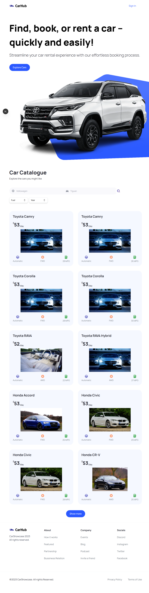
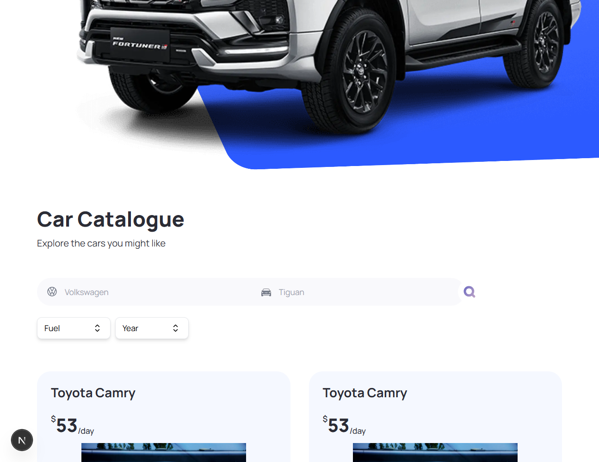
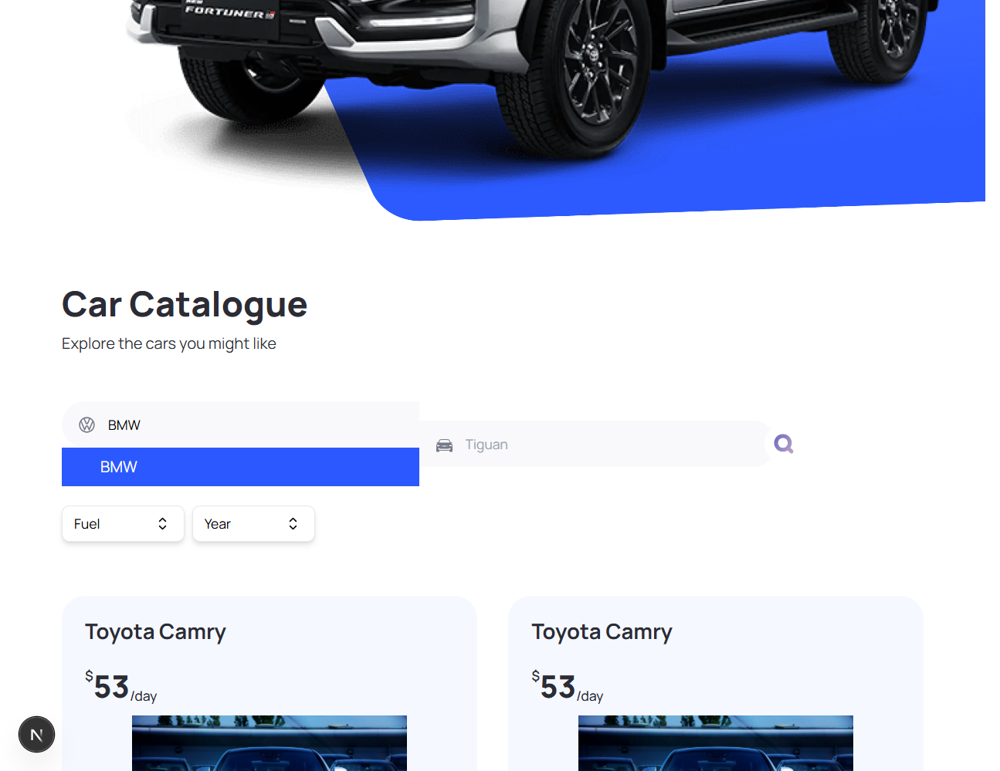
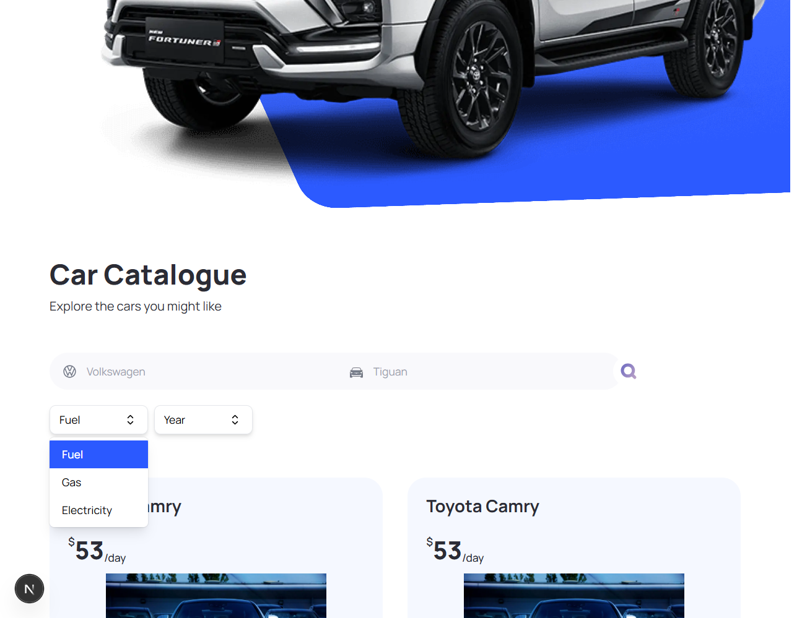

# 🚗 Car Showcase - Next.js 16

A modern, feature-rich car showcase and rental platform built with Next.js 16, React 19, TypeScript, and Tailwind CSS. Browse through an extensive catalogue of vehicles with advanced filtering and search capabilities.

## 📋 Table of Contents

- [Overview](#overview)
- [Screenshots](#screenshots)
- [Features](#features)
- [Tech Stack](#tech-stack)
- [Project Structure](#project-structure)
- [Getting Started](#getting-started)
- [Environment Variables](#environment-variables)
- [API Integration](#api-integration)
- [Car Images Setup](#car-images-setup)
- [Components](#components)
- [Utilities](#utilities)
- [Deployment](#deployment)
- [Contributing](#contributing)

## 🌟 Overview

Car Showcase is a comprehensive web application that allows users to explore, search, and filter through a diverse collection of cars. The application provides detailed information about each vehicle, including specifications, estimated rental costs, and high-quality images from multiple angles.

## 📸 Screenshots

### Homepage


_Hero section with car catalogue display showcasing the main landing page_

### Car Catalogue


_Browse through an extensive collection of vehicles with detailed specifications_

### Search Functionality


_Intelligent manufacturer search with autocomplete feature_

### Filter Options


_Advanced filtering by fuel type and production year_

## ✨ Features

- **🔍 Advanced Search**: Search cars by manufacturer and model
- **🎯 Smart Filtering**: Filter by fuel type and production year (2019-2023)
- **📱 Responsive Design**: Fully responsive UI built with Tailwind CSS
- **🖼️ Dynamic Images**: High-quality car placeholder images (Pexels integration ready)
- **💰 Rental Calculation**: Automatic rental price estimation based on car specifications
- **📄 Pagination**: Load more cars with "Show More" functionality
- **⚡ Server-Side Rendering**: Fast page loads with Next.js 16 App Router
- **🎨 Modern UI**: Clean interface with HeadlessUI v2 components
- **🔄 Real-time Updates**: Dynamic URL parameters for shareable searches
- **💾 Local Data**: 69 vehicles from 20+ manufacturers, no external API dependencies
- **🚀 Latest Stack**: React 19, Next.js 16, TypeScript 5.9

## 🛠️ Tech Stack

- **Framework**: [Next.js 16.1.4](https://nextjs.org/) (App Router)
- **Runtime**: [React 19.2.3](https://react.dev/)
- **Language**: [TypeScript 5.9.3](https://www.typescriptlang.org/)
- **Styling**: [Tailwind CSS 3.4.19](https://tailwindcss.com/)
- **UI Components**: [HeadlessUI React 2.2.9](https://headlessui.com/)
- **Images**: [Pexels API](https://www.pexels.com/api/) (Free, optional)
- **Data**: Local seed data (69 vehicles)

```
car_showcase-nextjs-13/
├── app/                      # Next.js 13 App directory
│   ├── globals.css          # Global styles
│   ├── layout.tsx           # Root layout component
│   └── page.tsx             # Home page (main catalogue)
├── components/              # React components
│   ├── CarCard.tsx         # Individual car display card
│   ├── CarDetails.tsx      # Modal with detailed car information
│   ├── CustomButton.tsx    # Reusable button component
│   ├── CustomFilter.tsx    # Filter dropdown component
│   ├── Footer.tsx          # Footer component
│   ├── Hero.tsx            # Hero section component
│   ├── Navbar.tsx          # Navigation bar component
│   ├── SearchBar.tsx       # Search functionality component
│   ├── SearchManufacturer.tsx  # Manufacturer search with autocomplete
│   ├── ShowMore.tsx        # Pagination component
│   └── index.ts            # Component exports
├── constants/              # Application constants
│   └── index.ts           # Manufacturers, years, fuel types, footer links
├── data/                   # Seed data
│   └── cars.ts            # Local car database (69 vehicles, 2019-2023)
├── types/                  # TypeScript type definitions
│   └── index.ts           # Interface definitions
├── utils/                  # Utility functions
│   └── index.ts           # Helper functions (fetch, calculate, generate)
├── public/                 # Static assets
├── next.config.js         # Next.js configuration
├── tailwind.config.ts     # Tailwind CSS configuration
├── tsconfig.json          # TypeScript configuration
└── package.json           # Project dependencies
```

## 🚀 Getting Started

### Prerequisites

- Node.js 18.17.0 or higher (recommended: Node.js 20+)
- npm, yarn, pnpm, or bun

### Installation

1. **Clone the repository**

   ```bash
   git clone <repository-url>
   cd car_showcase-nextjs-13
   ```

2. **Install dependencies**

   ```bash
   npm install
   # or
   yarn install
   # or
   pnpm install
   ```

3. **Set up environment variables**

   Create a `.env.local` file in the root directory (see [Environment Variables](#environment-variables))

4. **Run the development server**

   ```bash
   npm run dev
   # or
   yarn dev
   # or
   pnpm dev
   # or
   bun dev
   ```

5. **Open the application**

   Navigate to [http://localhost:3000](http://localhost:3000) in your browser

The page will auto-update as you edit files.

## 🔐 Environment Variables

Create a `.env.local` file in the root directory:

```env
# Pexels API (Optional - for dynamic car images)
NEXT_PUBLIC_PEXELS_API_KEY=your_pexels_api_key_here
```

### How to Obtain API Key

**Pexels API Key** (Optional - FREE):

- Register at [Pexels](https://www.pexels.com/api/)
- Get your free API key instantly
- The app works with placeholder images without this key
- Add the key to enable dynamic car-specific image searches

**Note**: The car data is now stored locally, so no external API key is required for vehicle data!

## 🔌 Data & API Integration

### Car Data

The application uses **local seed data** instead of external APIs:

- **Location**: `data/cars.ts`
- **Vehicles**: 69 cars across 20+ manufacturers
- **Years**: 2019-2023 model years
- **Brands**: Toyota, Honda, Ford, Tesla, BMW, Mercedes-Benz, Audi, Chevrolet, and more
- **Filtering**: Client-side filtering by manufacturer, model, year, and fuel type
- **Benefits**:
  - ✅ No API dependencies or rate limits
  - ✅ Fast response times (client-side filtering)
  - ✅ Complete control over data
  - ✅ Works offline
  - ✅ No API keys required for car data
  - ✅ Zero vulnerabilities

### Images

The application uses high-quality placeholder images from Pexels:

- **Current Implementation**: Consistent placeholder images that rotate based on car make/model
- **Optional Enhancement**: Uncomment the `fetchCarImageFromPexels` function in `utils/index.ts` to enable dynamic car-specific image searches
- **API**: [Pexels API](https://www.pexels.com/api/) - Completely free, 200 requests/hour
- **Benefits**: 100,000+ free car photos, no payment required

## 🖼️ Car Images Setup

The project supports multiple free image sources. By default, it uses curated placeholder images (no setup required).

### Quick Start (No Setup)

The app works immediately with high-quality placeholder images. No configuration needed!

### Enable Dynamic Images (Optional)

For car-specific images from Pexels:

1. Get a free API key from [Pexels](https://www.pexels.com/api/)
2. Add to `.env.local`: `NEXT_PUBLIC_PEXELS_API_KEY=your_key`
3. Follow instructions in [IMAGES_API_GUIDE.md](IMAGES_API_GUIDE.md)

**See [IMAGES_API_GUIDE.md](IMAGES_API_GUIDE.md) for:**

- Detailed setup instructions for Pexels, Unsplash, and Pixabay
- Code examples and implementation guides
- API comparison and recommendations
- Troubleshooting tips

## 🧩 Components

### Core Components

- **`Hero`**: Landing section with call-to-action
- **`SearchBar`**: Combined manufacturer and model search
- **`CustomFilter`**: Dropdown filters for fuel type and year
- **`CarCard`**: Displays individual car with key specs and rental price
- **`CarDetails`**: Modal showing comprehensive car information
- **`ShowMore`**: Pagination control for loading additional results
- **`Navbar`**: Top navigation with logo
- **`Footer`**: Footer with links and branding

### Reusable Components

- **`CustomButton`**: Versatile button with customizable styles and icons
- **`SearchManufacturer`**: Autocomplete search for car manufacturers using HeadlessUI Combobox

## 🛠️ Utilities

### `fetchCars(filters: FilterProps)`

Filters car data from local seed database based on parameters:

- **manufacturer**: Filter by car make (e.g., "Toyota", "Tesla")
- **year**: Filter by production year (2019-2023)
- **model**: Filter by model name
- **fuel**: Filter by fuel type ("gas", "electricity")
- **limit**: Maximum number of results to return

### `calculateCarRent(city_mpg: number, year: number)`

Calculates estimated daily rental price based on:

- Base price: $50/day
- Mileage factor: $0.10 per MPG
- Age factor: $0.05 per year

### `generateCarImageUrl(car: CarProps, angle?: string)`

Generates placeholder image URLs from Pexels for cars with different viewing angles.

**Optional Enhancement**: Uncomment `fetchCarImageFromPexels()` function for dynamic car-specific images.

### `updateSearchParams(type: string, value: string)`

Updates URL search parameters for shareable and bookmarkable searches.

## 📱 Responsive Design

The application is fully responsive with Tailwind CSS breakpoints:

- **Mobile**: Optimized for small screens
- **Tablet**: Medium screen layout adjustments
- **Desktop**: Full-featured experience

## 🎨 Styling

- **Tailwind CSS**: Utility-first CSS framework
- **Custom Colors**: Primary blue theme
- **Global Styles**: Defined in `app/globals.css`
- **Component Styles**: Tailwind classes for rapid development

## 📦 Build & Deployment

### Build for Production

```bash
npm run build
```

This creates an optimized production build in the `.next` folder.

### Start Production Server

```bash
npm start
```

Runs the production server on port 3000.

### Deploy on Vercel

The easiest deployment option:

1. Push your code to GitHub
2. Import your repository on [Vercel](https://vercel.com/new)
3. Add environment variables in Vercel dashboard
4. Deploy!

Vercel automatically optimizes your Next.js application.

**Alternative Deployment Platforms**:

- Netlify
- Railway
- AWS Amplify
- DigitalOcean App Platform

See the [Next.js deployment documentation](https://nextjs.org/docs/deployment) for more options.

## 🧪 Development Scripts

```bash
# Run development server
npm run dev

# Build for production
npm run build

# Start production server
npm start

# Run ESLint
npm run lint
```

## 📝 Type Definitions

The project includes comprehensive TypeScript interfaces:

- **`CarProps`**: Car object structure
- **`FilterProps`**: Search/filter parameters
- **`CustomButtonProps`**: Button component props
- **`CustomFilterProps`**: Filter component props
- **`SearchManufacturerProps`**: Manufacturer search props
- **`OptionsProps`**: Generic option structure

## 🔄 Updates & Migration Notes

### Image API Migration (2024)

The project has been updated to use **Pexels API** instead of Imagin Studio, as Imagin Studio now requires payment.

**Why Pexels?**

- ✅ **Completely FREE** - No payment required
- ✅ **100,000+ car photos** - Extensive library
- ✅ **200 requests/hour** - Generous free tier
- ✅ **High-quality images** - Professional stock photos
- ✅ **Easy integration** - Simple REST API

**Current Implementation:**

- The app uses curated placeholder images that rotate based on car make/model
- Works out of the box without any API key
- For dynamic car-specific images, add your Pexels API key and uncomment the `fetchCarImageFromPexels` function in `utils/index.ts`

**Alternative Free Options:**

- [Unsplash API](https://unsplash.com/developers) - Another excellent free option
- [Pixabay API](https://pixabay.com/api/docs/) - Free stock photos

### Latest Stack (January 2026)

**Major Updates:**

- ⬆️ **Next.js 13.5.3 → 16.1.4** - Latest stable version
- ⬆️ **React 18.2.0 → 19.2.3** - React 19 features
- ⬆️ **TypeScript 5.2.2 → 5.9.3** - Latest TypeScript
- ⬆️ **HeadlessUI 1.7.17 → 2.2.9** - v2 with improved APIs
- ⬆️ **Tailwind CSS 3.3.3 → 3.4.19** - Latest stable (v3)
- 🔄 **API-Ninjas → Local Data** - 69 cars, zero API dependencies

**Breaking Changes Fixed:**

- ✅ **Next.js 15+ `searchParams` is now async** - Must use `await` or `React.use()`
- ✅ **Image config** - Migrated from `domains` to `remotePatterns`
- ✅ **HeadlessUI v2** - Nullable onChange handlers
- ✅ **React 19** - Updated type definitions

## 🤝 Contributing

Contributions are welcome! To contribute:

1. Fork the repository
2. Create a feature branch (`git checkout -b feature/AmazingFeature`)
3. Commit your changes (`git commit -m 'Add some AmazingFeature'`)
4. Push to the branch (`git push origin feature/AmazingFeature`)
5. Open a Pull Request

## 📄 License

This project is open source and available under the MIT License.

## 🙏 Acknowledgments

- [Next.js Documentation](https://nextjs.org/docs) - React framework
- [React Documentation](https://react.dev/) - UI library
- [Tailwind CSS](https://tailwindcss.com/) - Utility-first CSS
- [HeadlessUI](https://headlessui.com/) - Unstyled UI components
- [Pexels](https://www.pexels.com/) - Free stock photos and API
- [TypeScript](https://www.typescriptlang.org/) - Type safety

## 📧 Support

For questions or support, please open an issue in the repository.

---

**Happy Coding! 🚀**
